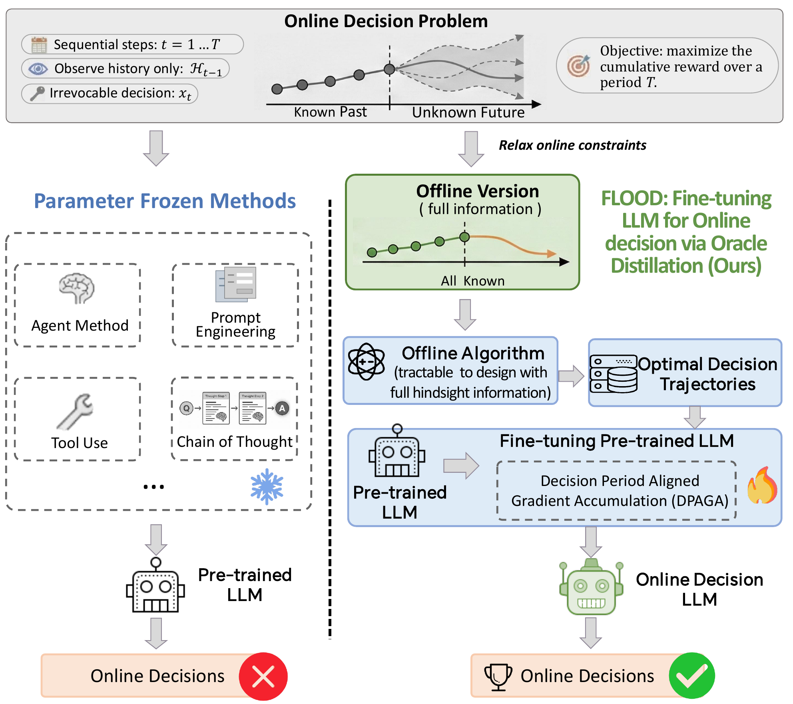

# FLOOD: Fine-tuning LLM with Offline Optimal Oracle for Online Decision Making

[](#usage)
[](#usage)
[](#method)

This repository contains the code, data files, and LoRA adapter weights for **FLOOD**,
a framework for fine-tuning large language models (LLMs) to make online decisions.

FLOOD addresses online decision-making problems where decisions must be made
sequentially without future information. The core idea is to relax the online
problem into an offline version, solve it with full hindsight to obtain oracle
decision trajectories, and then distill those trajectories into an LLM.

<p align="center">
  
</p>

## Overview

Online decision making appears in applications such as dynamic resource
allocation, scheduling, online advertising, and emergency logistics. At each
step, the decision maker observes historical information and the current request,
then makes an irrevocable action before future requests are known.

FLOOD, short for **Fine-tuning LLM for Online decision via Oracle Distillation**,
turns this difficult online learning problem into a tractable oracle-distillation
pipeline:

1. Construct an offline oracle with full access to future requests.
2. Solve the offline problem to generate optimal decision trajectories.
3. Convert each trajectory into prompt-response training examples.
4. Fine-tune a pretrained LLM with LoRA.
5. Align optimization with decision periods using **Decision Period Aligned
   Gradient Accumulation (DPAGA)**.

The IJCNN 2026 accepted camera-ready paper evaluates FLOOD on synthetic online
resource-allocation instances and a real-world sequential emergency dataset. The
results show that FLOOD can generalize from synthetically generated oracle
trajectories to online deployment settings, and that DPAGA is important for
stable oracle distillation.

## Repository Structure

```text
.
|-- readme.md
|-- assets/
|   `-- overview.png
|-- train/
|   |-- ODLLM/
|   |   |-- get_data/offline_algorithm/
|   |   |   |-- offline_main.ipynb
|   |   |   `-- zhengtai.py
|   |   |-- train.ipynb
|   |   |-- train_data/
|   |   `-- weight/
|   `-- ODLLM2/
`-- test/
    |-- cr_and_others/
    `-- regret/
```

## Main Components

- `train/ODLLM/get_data/offline_algorithm/`: offline-oracle construction and
  synthetic data generation utilities.
- `train/ODLLM/train_data/`: oracle-distilled training data in conversation
  format.
- `train/ODLLM/train.ipynb`: LoRA fine-tuning workflow for the online decision
  LLM.
- `train/ODLLM/weight/`: trained LoRA adapter for the FLOOD model.
- `train/ODLLM2/`: an additional LoRA adapter/checkpoint used in experiments.
- `test/cr_and_others/`: evaluation data for competitive ratio and related
  metrics.
- `test/regret/`: regret-evaluation baselines and test data.

## Method

FLOOD is built around two stages.

### 1. Offline Oracle Construction

The online problem is relaxed into an offline version where the full sequence of
requests is known. In the paper's resource-allocation setting, each request
contains resource demand, transportation cost, and reward. The oracle solves the
offline problem and produces binary decision labels for each step.

### 2. Online Policy Distillation

The oracle decisions are converted into sequential prompts. During inference,
the LLM only receives the observable history and current request; future
information is used only for generating labels during training.

Fine-tuning is performed with LoRA. The adapter configuration in this repository
uses:

- base model: `chatglm3-6b`
- PEFT method: LoRA
- LoRA rank: `8`
- LoRA alpha: `32`
- LoRA dropout: `0.1`
- target module: `query_key_value`

The DPAGA strategy accumulates gradients over a complete decision period before
performing an optimizer update. This better aligns parameter updates with the
long-horizon objective of online decision making.

## Data Format

Training and evaluation samples are stored in JSON-lines conversation format.
Each example contains:

- a `user` prompt describing the online decision context, historical decisions,
  remaining resources, remaining transportation budget, and current request;
- an `assistant` response containing the decision label.

The model is trained to output a one-token decision such as accepting or
rejecting the current request.

## Usage

The repository is organized around notebooks.

### Generate Oracle Data

Open and run:

```text
train/ODLLM/get_data/offline_algorithm/offline_main.ipynb
```

This notebook constructs offline oracle solutions and exports trajectory data
used to build supervised decision examples.

### Fine-tune FLOOD

Open and run:

```text
train/ODLLM/train.ipynb
```

Before training, make sure the base model path in the notebook matches your local
environment. The default path is:

```python
model_name = "../chatglm3-6b"
```

### Evaluate

Use the data and baselines under:

```text
test/cr_and_others/
test/regret/
```

The paper reports evaluation with accuracy, competitive ratio (CR), regret, and
resource over-ratio (OR).

## Citation

If this repository is useful for your research, please cite:

```bibtex
@inproceedings{qiu2026flood,
  title     = {FLOOD: Fine-tuning LLM with Offline Optimal Oracle for Online Decision Making},
  author    = {Qiu, Tao and Xiao, Kaiming and Zhang, Hang and Chen, Zhihao and Yang, Haoyu and Li, Xuan and Wang, Mao},
  booktitle = {IJCNN},
  year      = {2026}
}
```

## Acknowledgment

This work is supported by the National Natural Science Foundation of China
(No. 72301291).
